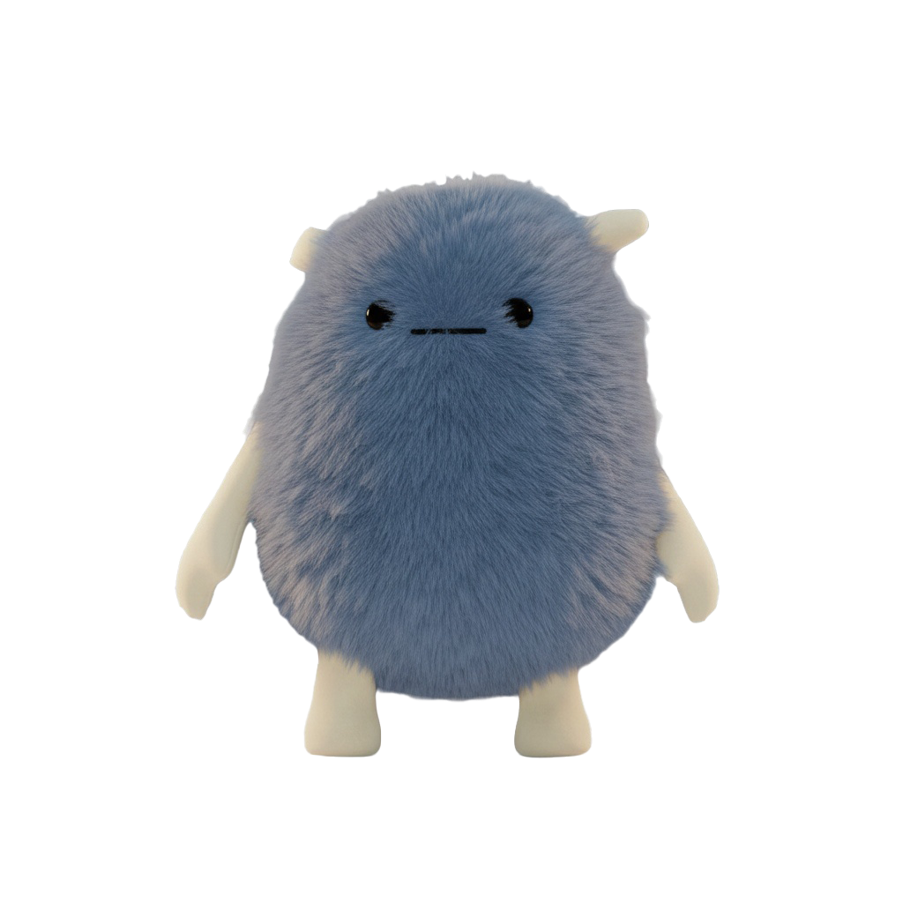

<p align="center">
  
</p>

# <p align="center">蓝色小嗵</p>

<p align="center"><strong>一只住在你桌面上的蓝色小精灵，能聊天、有记忆、会成长。</strong></p>

<p align="center">
  
  
  
</p>

TA会跟着你的鼠标转眼睛，你喂TA，TA会高兴，你忘了TA，TA会饿。TA还会因为你的键盘输入速度而抖动欢呼~接入任意 OpenAI 兼容接口（DeepSeek / GPT / Claude 中转等），和TA说话，TA会记住你说过的事。

---

## 功能

**知识与记忆管理（核心）**
- 独立的知识中心窗口，统一管理所有 TA 知道的事
- 记忆按来源自动分类：**对话**中提取、**文档**导入、**网络**爬取，随时筛选查看
- 支持自定义文件夹，将不同主题的记忆分类归档
- 可手动向知识库添加任意内容，TA 下次聊天就会知道
- 角色设定文档**永久生效**，直接导入 `.txt` 文档即可定义 TA 的性格和背景
- 一键信息搜集：抓取任意网页内容（支持 B 站、百度百科、通用网页）整理入库
- 关键字搜索全部记忆，实时显示记忆总条数

**桌面陪伴**
- 常驻桌面，陪你工作、学习、摸鱼，不打扰不遮挡
- idle 状态下眼睛实时跟随鼠标光标
- 可拖拽抛出，带重力和边界回弹
- 流畅序列帧动画：行走、摸头、吃东西、睡觉/唤醒、玩耍、变猫猫、学习

**养成系统**
- 宠物属性：饥饿度、快乐度、精力、亲密度、等级 / 经验值
- 属性随时间自然衰减，长时间不互动 TA 会变得不开心
- 每日签到、每日任务、成就系统、金币商店、背包道具

**对话**
- 接入任意 OpenAI 兼容接口，一个 URL + Key 即可配置
- 对话中自动提取关键事实，悄悄记住你说过的每件事
- 回复以气泡形式实时显示在桌宠旁边

---

## 环境要求

- Windows 10 / 11
- Python 3.10+
- PyQt5

## 安装与运行

```bash
pip install PyQt5
python main.py
```

## 首次使用

1. 启动后右键桌宠 → **查看状态**
2. 面板自动跳转到「设置」页
3. 填写 API 地址和 Key，点击「测试连接」
4. 切换到「聊天」页，开始和 TA 说话

## 数据存储

所有个人数据存放在程序目录下的 `geren/` 文件夹中，解压到哪里数据就跟到哪里，不占用 C 盘空间。

```
desktop-pet/
└── geren/
    ├── chat_config.json    # API 配置
    ├── chat_memory.json    # 聊天记录与记忆
    ├── pet_save.json       # 宠物存档
    ├── game_data.json      # 游戏进度
    └── avatar_custom.png   # 自定义头像
```

## 技术栈

- Python 3.10+
- PyQt5
- urllib（标准库，无第三方 HTTP 依赖）

---
